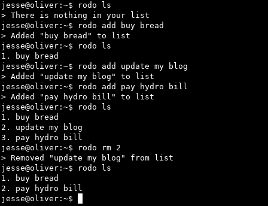

# rodo

A simple todo list tool for people who live on the command-line

# Screenshot



# New things added!

Now the default directory and todo list file have better default permissions:

* `~/.rodo/` is set to 700 by default
* `~/.rodo/todo.txt` is set to 600 by default.

# Todos

- Add color option to config.rkt file
- Encrypt todo-list file
- Add note on .bash_history about items being added here before going into the todo.txt file

# Table of Contents

* [Platforms](https://github.com/m455/rodo#platforms)
* [Requirements](https://github.com/m455/rodo#requirements)
* [Downloading](https://github.com/m455/rodo#downloading)
    * [Option one: Via Git](https://github.com/m455/rodo#option-two-via-git)
    * [Option two: Via GitHub on a web browser](https://github.com/m455/rodo#option-one-via-github-on-a-web-browser)
* [Setup](https://github.com/m455/rodo#setup)
    * [GNU/Linux](https://github.com/m455/rodo#gnulinux)
* [Usage](https://github.com/m455/rodo#usage)
    * [Usage examples](https://github.com/m455/rodo#usage-examples)
* [Configuration](https://github.com/m455/rodo#configuring-rodo)

# Platforms

Below is a list of platform(s) that `rodo` is currently available for.

* GNU/Linux

# Requirements

Below is a list of items needed for running `rodo` on your machine.

* [Racket 6.x](https://racket-lang.org/)
* [GNU coreutils](https://wiki.debian.org/coreutils)(`chmod` at least)

# Downloading

Currently, there are two options for downloading the source code. Choose one from the
list below:

## Option one: Via Git

Follow the steps below to download `rodo` using the `git` command.

1. Ensure `git` is installed
2. Run `git clone https://github.com/m455/rodo` on the command line

## Option two: Via GitHub on a web browser

Follow the steps below to download `rodo` from your web browser.

1. Click the *Clone or download* button at the top of this page
2. Click *Download ZIP* from the drop-down list

# Setup

Follow the sections below to set up `rodo`, so it can be used from anywhere on
your system.

**If you just want to test `rodo` out, then just `cd` into the directory you downloaded
`rodo` into, and then run `./rodo.rkt`.**

## GNU/Linux

Follow the sections below to add `rodo` to your `$PATH`, if you are using
GNU/Linux.

### Set up a `$PATH`

Follow the steps below if you haven't set up a `$PATH`.

**Tip: If you have set up a `$PATH` already, then skip to the next step, [Adding
`rodo` to your `$PATH`](https://github.com/m455/rodo#adding-rodo-to-your-path).**

1. Create a directory for your `$PATH` by running `mkdir ~/bin/`
2. Add your newly-created `~/bin/` to your `$PATH` by running `echo "export PATH=~/bin:\$PATH" >> .bashrc`

### Adding `rodo` to your `$PATH`

Follow the steps below to add the `rodo.rkt` file to your `$PATH`.

**Tip: If you prefer to use an executable, rather than a wrapper (see the note after step one below), you can create an
executable binary file with `raco exe rodo.rkt` when in the same folder as the
`rodo.rkt` file. If you are having trouble with this please refer to Racket's
documentation regarding the [creation of standalone executables](https://docs.racket-lang.org/raco/exe.html).**

1. Create a file in your `~/bin/` directory with the following contents in it:

```
#!/usr/bin/env bash
racket ~/path/to/rodo.rkt "$@"
```

**Note: The creation of a file that runs another program is called a "wrapper"**

For example: If you downloaded the project to your `~/downloads/` folder you would change the line
`racket ~/path/to/rodo.rkt "$@"` to `racket ~/downloads/rodo/rodo.rkt "$@"`.

2. Save the file

3. Make the file executable by running `chmod u+x ~/bin/name-of-your-file`

# Usage

Type `rodo` plus one of the commands below with a space
between `rodo` and the command.

`init` - Initializes a file called `todo.txt` in `~/.rodo/` by default

**Note: The directory and filename can be changed by modifying the `config.rkt` file**

`ls` - Displays items from the todo list in a vertical format

`add` - Adds an entry to the todo list

`rm` - Removes an item from the todo list

**Note: You may have to run `rodo ls` to see which number corresponds to which item when removing items.**

## Usage examples

The examples below assume that you have `rodo` [set up in your `$PATH`](https://github.com/m455/rodo#set-up-a-path) in your `$PATH`

`rodo init`

`rodo ls`

`rodo add "go to the park"`

**Note: If you leave out the double quotation marks here, only the first word**
will be added. In the example above, only "go" would be added to the list.

`rodo rm 1`

# Configuring `rodo`

**Caution: Change the `config.rkt` file at your own risk, as it may break things!**

Right now, the configurations can be found in the `config.rkt file`. Settings,
such as the program name, directory, and the filename of the todo list file can
be changed.

