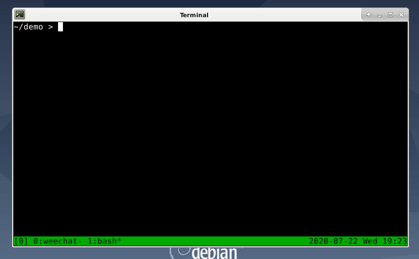

# rodo

rodo is a todo-list program for the command line.

# Screenshot



# Table of Contents

- [Disclaimer](#disclaimer)
- [Conventions used in this document](#conventions-used-in-this-document)
- [Platforms](#platforms)
- [Requirements](#requirements)
- [Quick start](#quick-start)
- [Downloading rodo](#downloading-rodo)
    - [Downloading rodo using git](#downloading-rodo-using-git)
        - [To download rodo using git](#to-download-rodo-using-git)
- [Installing rodo](#installing-rodo)
    - [Installing rodo globally](#installing-rodo-globally)
        - [To install rodo globally](#to-install-rodo-globally)
    - [Installing rodo locally](#installing-rodo-locally)
        - [To install rodo locally](#to-install-rodo-locally)
    - [Installing rodo to a custom directory](#installing-rodo-to-a-custom-directory)
        - [To install rodo to a custom directory](#to-install-rodo-to-a-custom-directory)
- [Uninstalling rodo](#uninstalling-rodo)
    - [Uninstalling rodo globally](#uninstalling-rodo-globally)
        - [To uninstall rodo globally](#to-uninstall-rodo-globally)
    - [Uninstalling rodo locally](#uninstalling-rodo-locally)
        - [To uninstall rodo locally](#to-uninstall-rodo-locally)
- [Using rodo](#using-rodo)
    - [Initializing rodo](#initializing-rodo)
        - [To initialize rodo](#to-initialize-rodo)
    - [Showing the help message](#showing-the-help-message)
        - [To show the help message](#to-show-the-help-message)
    - [Displaying your list](#displaying-your-list)
        - [To display your list](#to-display-your-list)
    - [Adding an item to your list](#adding-an-item-to-your-list)
        - [To add an item to your list](#to-add-an-item-to-your-list)
    - [Removing an item from your list](#removing-an-item-from-your-list)
        - [To remove an item from your list](#to-remove-an-item-from-your-list)
- [List of commands](#list-of-commands)
- [Usage examples](#usage-examples)

# Disclaimer

This is a hobby project I built for myself to keep track of todos
related to my hobbies.

I take no responsibility for anything that rodo deletes.

Backup anything you don't want deleted.

# Conventions used in this document

* **Note**: Notes signify additional information
* **Tip**: Tips signify an alternative procedure for completing a step
* **Warning**: Warnings signify that damage, such as data loss, may occur
* **Example**: Examples provide a reference of how a procedure would be performed in the real world
* `Inline code`: Inline code signifies package names, filenames, or commands
* ```Code block```: Code blocks signify file contents

# Platforms

Below is a list of platforms that rodo can run on:

* GNU/Linux
* Windows (Using Windows Subsystem for Linux)
* macOS (Using [Homebrew](https://brew.sh/))

# Requirements

The following items must be downloaded and installed before you can use rodo:

* Racket: [https://racket-lang.org/](https://racket-lang.org/)
* rodo's source code: [https://git.m455.casa/m455/rodo](https://git.m455.casa/m455/rodo)

# Quick start

This section is for users who are familiar with git, a Unix-like command line environment, or
scripting.

1. Make sure [Racket](https://racket-lang.org/) is installed
2. `git clone git://git.m455.casa/rodo.git`
3. `cd rodo`
4. `sudo make install-global`
5. `rodo`

**Note**: To uninstall, run `sudo make uninstall-global`

* `rodo help` - Displays the help message
* `rodo add "your task here"` - Adds the message inside of quotation marks to your todo list
* `rodo ls` - Displays your todo list
* `rodo rm 2` - Removes the third item from your list. (The list starts at 0)

**Note**: You may need to run `rodo ls` to see which number corresponds to which item in your list before running `rodo rm <number>`

# Downloading rodo

rodo's source code exists in a public git repository. This makes
accessing the code convenient, because you don't need to sign in or
register for an account to download it.

## Downloading rodo using git

You can use tools such as `git` to download rodo's source code. You
will need the source code to install rodo.

### To download rodo using git

1. Run `git clone git://git.m455.casa/rodo.git`

**Note**: This will create a `rodo` directory in your current directory.

# Installing rodo

You can either install rodo globally or locally on your system. A global installation allows all users on a machine to use rodo, while a local installation only allows one user to use rodo.

See the options below for installing rodo:

* [Installing rodo globally](#installing-rodo-globally)
* [Installing rodo locally](#installing-rodo-locally)
* [Installing rodo to a custom directory](#installing-rodo-to-a-custom-directory)

## Installing rodo globally

This option will install rodo into `/usr/local/bin/`.

This section assumes you have [downloaded rodo](#downloading-rodo).

### To install rodo globally

1. Run `cd rodo`
2. Run `sudo make install-global`

## Installing rodo locally

This option will install rodo into `~/.local/bin/`.

This section assumes you have [downloaded rodo](#downloading-rodo).

### To install rodo locally

1. Run `cd rodo`
2. Run `sudo make install-local`

## Installing rodo to a custom directory

If you wish to have rodo exist elsewhere on your system, you can also
build a single-file executable. Building a single-file executable
allows you to place the executable in convenient places on your
system, such as a directory on your `$PATH`.

This section assumes you have [downloaded rodo](#downloading-rodo).

### To install rodo to a custom directory

**Warning**: You will have to manually uninstall custom installations

1. Run `cd rodo`
2. Run `make install-custom location=~/path/to/custom/location`

**Example**: In step 2., you could run `make install-custom location=~/bin/`

# Uninstalling rodo

Depending on your installation method, you can uninstall a global or local installation of rodo.

See the options below for uninstalling rodo:

* [Uninstalling rodo globally](#uninstalling-rodo-globally)
* [Uninstalling rodo locally](#uninstalling-rodo-locally)

## Uninstalling rodo globally

This option will remove the `rodo` executable from `/usr/local/bin/`.

This section assumes you have [downloaded rodo](#downloading-rodo).

### To uninstall rodo globally

1. Run `cd rodo`
2. Run `sudo make uninstall-global`

## Uninstalling rodo locally

This option will remove the `rodo` executable from `~/.local/bin/`.

This section assumes you have [downloaded rodo](#downloading-rodo).

### To uninstall rodo locally

1. Run `cd rodo`
2. Run `sudo make uninstall-local`

# Using rodo

This section will teach you how to use rodo's commands.

This section assumes you have [installed rodo](#installing-rodo).

## Initializing rodo

Before using rodo, you will need to initialize it. This means rodo will create a `~/.rodo` file.

### To initialize rodo

1. Run `rodo init`
2. Choose `y`

## Showing the help message

The help message will provide a list of available commands. This is list useful in case you forget
the name of a command or how to use a command.

### To show the help message

1. Run `rodo help`

## Displaying your list

Displaying your list will allow you to view the items you have added to your list.
You will notice numbers beside the items in your list.

**Note**: These numbers are useful references for when you want to remove items from your list. For
more information, see the [Removing an Item from Your List](#removing-an-item-from-your-list) topic.

### To display your list

1. Run `rodo ls`

## Adding an item to your list

Adding an item to your list will save it to a text file to access later.

### To add an item to your list

1. Run `rodo add "this is an example of an item using double quotation marks"`

## Removing an item from your list

When removing an item from your list, you can reference the numbers beside each item when
[Displaying Your List](#displaying-your-list). You can use these numbers when removing an item from
your list.

### To remove an item from your list

1. Run `rodo rm 1`

**Note 1**: The "1" in the procedure above will remove the first item in your
list.

**Note 2**: You may need to run `rodo ls` first to see which numbers correspond
with which item in your list.

# List of commands

This section lists and describes rodo's commands.

* `init` intializes the `~/.rodo` file
* `help` displays the help message
* `ls` displays your list
* `add` adds an item to your list
* `rm` removes an item from your list

# Usage examples

`rodo init`

`rodo help`

`rodo ls`

`rodo add "this is an item"`

`rodo rm 1`

